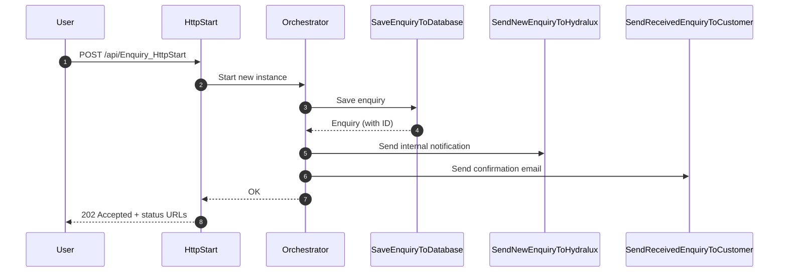

# Hydralux Enquiry Durable Function

A cloud‑native, event‑driven workflow built using **Azure Durable Functions (Isolated Worker)**.  
This workflow processes customer enquiries end‑to‑end:

1. Accept enquiry from the website
2. Persist the enquiry to PostgreSQL
3. Notify HydraLux internally
4. Send confirmation to the customer

The architecture is designed for reliability, observability, and future expansion into additional workflows such as bookings and quote requests.

---

## 🚀 Features

- Durable, replay‑safe orchestrators
- Clean separation of concerns (Triggers, Orchestrators, Activities, Services)
- PostgreSQL persistence using Npgsql
- Email delivery via Resend
- Dependency Injection for all services
- Local‑development‑friendly (automatic purge of old instances)
- Fully typed workflow models

---

## 📁 Project Structure
--

## 🔄 Enquiry Workflow

```mermaid
flowchart TD

A[HTTP Trigger: EnquiryHttpStart] --> B[Start Orchestrator]

B --> C[Activity: SaveEnquiryToDatabase]
C --> D[Activity: SendNewEnquiryToHydralux]
D --> E[Activity: SendReceivedEnquiryToCustomer]

E --> F[Return: OK]

# 🧭 **Diagram of the Enquiry Workflow**
``` 
